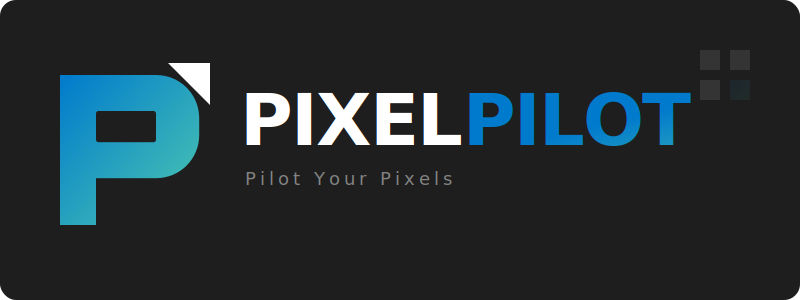

# PixelPilot



**Pilot Your Pixels.**

PixelPilot is a Windows desktop automation agent powered by **Gemini (Google GenAI SDK)** plus computer vision. It turns natural language commands into real mouse and keyboard actions, mixes in native OS skills where possible, and can bridge Secure Desktop (UAC) prompts with an optional helper service.

## Architecture


> [View Detailed Architecture Diagram](src/logos/System-Architecture_Detailed.png)

## Features

### Multimodal Planning and Vision
- **Gemini planning model**: Uses `GEMINI_MODEL` (default `gemini-3-flash-preview`).
- **Two vision modes** (switch in UI):
    - **ROBO (default)**: Gemini Robotics-ER for semantic UI understanding (optionally uses bounding boxes).
    - **OCR**: Local EasyOCR + OpenCV (OCR + edge based detection).
- **Lazy vision fallback**: If Robotics is unavailable or ambiguous, it falls back to OCR.
- **Magnification**: Zoom into dense UI regions before selecting an element.
- **Reference sheets**: Optional grid of cropped UI elements to help with small icons.

### Operation Modes
- **GUIDANCE**: Interactive, step-by-step tutorial mode. You do the actions while PixelPilot watches and helps.
- **SAFE**: Confirms only potentially dangerous actions (like delete, shutdown).
- **AUTO**: Runs fully autonomously without requiring confirmation.
- **Blind mode**: When vision is not needed, PixelPilot can plan and act without screenshots and switch back to vision when required.

### Agent Desktop and Sidecar
- **Agent Desktop**: Optional isolated desktop workspace for safer background tasks.
- **Sidecar preview**: Live, read-only preview of the Agent Desktop attached to the main window.
- **Workspace switching**: The agent can switch between the user desktop and agent desktop.

> **Note**: Opening the same application instance in both the User and Agent desktops simultaneously might behave weirdly. We have tried our best to isolate the two desktops (e.g., using separate user data directories) and will continue to improve this isolation.

### UAC / Secure Desktop Integration (Optional)
- **UAC Orchestrator**: Scheduled task runs a SYSTEM service on startup.
- **Trigger files**:
    - `%SystemRoot%\Temp\uac_trigger.txt` signals the orchestrator.
    - `%SystemRoot%\Temp\uac_snapshot.bmp` contains a Secure Desktop snapshot.
    - `%SystemRoot%\Temp\uac_response.txt` receives `ALLOW` or `DENY`.

### Skills and Tooling
- **Media / Browser / System / Timer skills**: Uses OS APIs where possible instead of UI driving.
- **Smart App Indexer**: Uses Start Menu shortcuts, running processes, and registry to find apps.
- **Loop detection**: Detects repeated actions with perceptual hashing and suggests alternatives.
- **Task verification**: Optional screen verification to confirm completion.
- **Voice input**: Mic button uses SpeechRecognition with an audio level visualizer.
- **Global hotkeys**: System-wide hotkeys work even when the overlay is click-through.

## Quick Start

### 1. Installation

Run the installer to set up the Python environment and (optionally) the UAC orchestrator and launcher tasks.

```bash
python install.py
```

What it does:
- Creates a `venv` and installs `requirements.txt`.
- Compiles the UAC helper executables from [src/uac/orchestrator.py](src/uac/orchestrator.py) and [src/uac/agent.py](src/uac/agent.py).
- Creates scheduled tasks:
    - `PixelPilotUACOrchestrator` (runs as SYSTEM on startup)
    - `PixelPilotApp` (launcher task; the Desktop shortcut runs this task)
- Creates a Desktop shortcut that runs `schtasks /RUN /TN "PixelPilotApp"`.

Optional (deps only, no scheduled tasks or shortcut):

```bash
python install.py --no-tasks
```

### 2. Configuration

Create a `.env` file in the repository root (next to [install.py](install.py)):

```env
GEMINI_API_KEY=your_api_key_here
GEMINI_MODEL=gemini-3-flash-preview

# Default UI mode: guide | safe | auto
DEFAULT_MODE=auto

# Runtime override (if set, overrides DEFAULT_MODE)
AGENT_MODE=auto

# Vision mode: robo | ocr
VISION_MODE=robo

# Optional: WebSocket gateway auth token
PIXELPILOT_GATEWAY_TOKEN=pixelpilot-secret
```

Tip: you can start from [env.example](env.example).

Notes:
- `DEFAULT_MODE` selects the initial UI mode.
- `AGENT_MODE` overrides `DEFAULT_MODE` when present.
- `VISION_MODE` is `robo` (Gemini Robotics-ER) or `ocr` (local OCR + CV).

### 3. Run

**Method 1: Desktop Shortcut (Recommended)**
Double-click the PixelPilot shortcut. This launches the agent with the permissions needed to communicate with the UAC orchestrator.

**Method 2: Command Line**

```bash
.\venv\Scripts\python.exe .\src\main.py
```

Notes:
- PixelPilot is GUI-first (PySide6). You can change Mode and Vision from the dropdowns.
- On Windows, PixelPilot tries to relaunch with Administrator privileges. If you decline, some automation is limited.
- Logs are written to `logs/pixelpilot.log` (and launcher logs to `logs/app_launch.log`).

### Hotkeys (system-wide)
- `Ctrl+Shift+Z` - Toggle click-through (overlay interactive vs click-through)
- `Ctrl+Shift+X` - Stop current request
- `Ctrl+Shift+Q` - Quit PixelPilot

## Architecture

PixelPilot uses a multi-process architecture to bridge userland automation and Secure Desktop.

1. **Main App ([src/main.py](src/main.py))**
     - Runs in the user session.
     - Provides the PySide6 UI and routes agent output into the GUI.
     - Captures screenshots, plans actions with Gemini, and executes input (mouse/keyboard).
     - Detects Secure Desktop/UAC symptoms (black screenshots or access denied) and triggers the orchestrator.

2. **UAC Orchestrator ([src/uac/orchestrator.py](src/uac/orchestrator.py))**
     - Runs as SYSTEM via Task Scheduler on boot.
     - Watches for `%SystemRoot%\Temp\uac_trigger.txt`.
     - Launches the UAC Agent in the WinLogon Secure Desktop session.

3. **UAC Agent ([src/uac/agent.py](src/uac/agent.py))**
     - Captures a Secure Desktop snapshot to `%SystemRoot%\Temp\uac_snapshot.bmp`.
     - Waits for `%SystemRoot%\Temp\uac_response.txt` and presses Allow or Deny.

4. **Vision Pipeline**
     - **Capture**: Uses `mss` first when possible, then falls back to `pyautogui`.
     - **Analysis**:
         - **ROBO**: Gemini Robotics-ER element detection.
         - **OCR**: EasyOCR + OpenCV contour/icon candidates.
     - **Planning**: Sends the screenshot plus an annotated overlay to Gemini.

5. **Agent Desktop (Optional)**
     - Isolated desktop via [src/desktop/desktop_manager.py](src/desktop/desktop_manager.py).
     - Minimal taskbar shell for the agent session plus a sidecar preview in the main UI.

## Optional WebSocket Gateway

There is a simple gateway server in [src/services/gateway.py](src/services/gateway.py) that accepts JSON commands over WebSocket and runs them through the agent. It is not started by default; import and run it from your own entry point if needed.

## Usage Examples

Natural language commands:
- "Open Calculator and calculate 25 * 34"
- "Find Spotify and play the next song"
- "Open Device Manager as admin" (triggers UAC orchestrator)
- "Search Google for Python tutorials and open the first link"

PixelPilot runs as a standard desktop GUI app; close the window to exit.

## Uninstall

Run the uninstaller (removes scheduled tasks, shortcut, venv, dist, logs, media, and cache):

```bash
python uninstall.py
```

Optional flags:
- `--no-tasks` to keep scheduled tasks and the desktop shortcut.
- `--keep-venv` to keep the venv directory.
- `--keep-dist` to keep the dist directory.
- `--keep-logs` to keep logs.
- `--keep-media` to keep media outputs.
- `--keep-cache` to keep the app index cache.

## Troubleshooting

- If the app opens and closes immediately, verify `.env` has `GEMINI_API_KEY`.
- Check logs in `logs/pixelpilot.log`.
- If UAC handling does not work:
    - Re-run `python install.py` as Administrator to recreate scheduled tasks.
    - Verify the `PixelPilotUACOrchestrator` scheduled task is running.

## License

MIT

---

**Made with Gemini + computer vision.**
